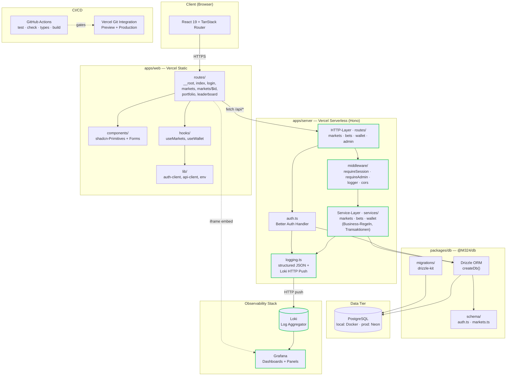
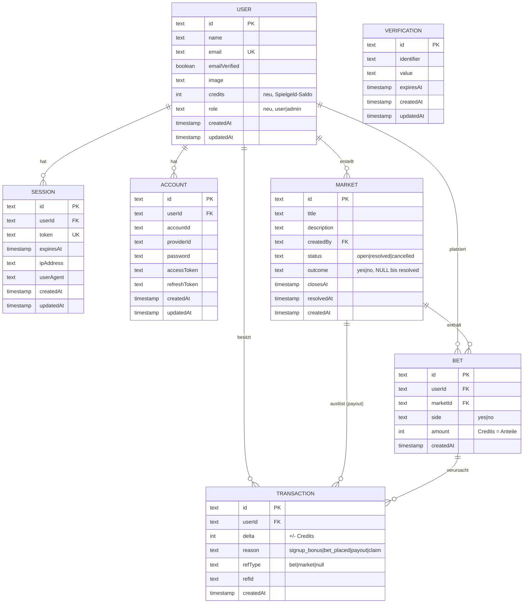

# M324 — Architektur

Diese Datei dokumentiert die Architektur, das Datenmodell und den Betrieb der M324-Anwendung. Sie ergänzt das [README](../README.md) (Setup und Skripte) um konzeptionelle Tiefe für Review und Präsentation.

## 1. Domänen-Idee (kurz)

Spielbare Internet-Satire-Plattform mit virtuellen Credits. User platzieren YES/NO-Wetten auf binäre Märkte. Märkte sind user-erstellt, werden von einem Admin aufgelöst (`status = resolved` mit `outcome`), und beim Auflösen wird der Pool pari-mutuel (proportional) an die Gewinner-Seite verteilt.

**Bewusst nicht in v1:**

- Echtes Geld, Payment-Provider, KYC.
- AMM/Orderbook-Pricing (1 Credit = 1 Anteil; Auszahlung erst beim Resolve).
- Community-Resolution per Voting (Sybil-anfällig).
- Daily Credit Refill via Cron (Initial-Allocation + manueller Claim genügt).
- KI-News-Marktgenerator.

Diese Einschränkungen sind explizit, damit der Scope für ein DevOps-Modul beherrschbar bleibt und Tests/Observability echte Substanz bekommen, statt sich an UX-Features zu verzetteln.

## 2. Page-Struktur

```
PUBLIC
├── /                      Landing (Parodie-Copy, CTA Login)
├── /login   /signup       Auth (Better Auth Forms)

AUTH REQUIRED
├── /markets               Feed offener Märkte, Balance im Header
├── /markets/$id           Markt-Detail: Pool, Bet-Form, Bet-History
├── /markets/new           Markt erstellen
├── /portfolio             Eigene Positionen + Transaction-Log
└── /leaderboard           Top User nach PnL

ADMIN ONLY
└── Resolve-Aktion auf /markets/$id (gleiche Route, conditional UI)
```

Der bestehende `/dashboard`-Route wird zu `/markets` umgebaut.

## 3. Layering



Grün umrandet = neu zu bauen. Alles andere existiert bereits.

### Verantwortlichkeiten der Server-Schichten

- **HTTP-Layer (`routes/`)** — parsen Request, validieren Schema (Zod), rufen Services, formatieren Response. Keine Business-Logik.
- **Middleware (`middleware/`)** — `requireSession`, `requireAdmin`, CORS, Logger. Querschnitt.
- **Service-Layer (`services/`)** — Geschäftsregeln, atomare Operationen via `db.transaction(...)`. Werfen Domain-Errors (z. B. `InsufficientCreditsError`), die das HTTP-Layer auf HTTP-Codes mappt.
- **Auth (`auth.ts`)** — Better-Auth-Handler, eingebunden über eigenen Hono-Mount auf `/api/auth/*`.
- **Logging (`logging.ts`)** — strukturierte JSON-Events, Console-Sink (für Vercel/stdout) und Loki-HTTP-Push-Sink.

## 4. Datenmodell



### Designentscheidungen

- **`user.credits`** ist denormalisiert für schnelle Reads (Header-Balance auf jeder Page). Single Source of Truth ist trotzdem `transaction` — invarianz-prüfbar via `SUM(delta) WHERE userId = X` muss `user.credits` entsprechen. Diese Invariante ist ein Integrationstest-Kandidat.
- **Positionen** sind keine eigene Tabelle, sondern werden bei Bedarf aus `bet` aggregiert (`SUM(amount) WHERE userId AND marketId AND side`). Spart eine Tabelle, vermeidet Konsistenz-Drift. Bei Performance-Druck später als Materialized View nachziehbar.
- **`bet`** und **`transaction`** sind append-only Logs. Kein Update, kein Delete. Macht Audit/History trivial.
- **`onDelete: cascade`** auf `bet.userId` und `bet.marketId` fliegt absichtlich raus, sobald wir Märkte historisch behalten wollen — dann wird `cancelled` der Soft-Delete.

## 5. Kritische Pfade

### Bet platzieren

1. `POST /api/bets` mit `{ marketId, side, amount }`.
2. `requireSession` → `userId`.
3. Service `bets.placeBet` öffnet `db.transaction`:
   - Lock User-Row (`SELECT ... FOR UPDATE`).
   - Prüft `user.credits >= amount`, sonst `InsufficientCreditsError`.
   - Prüft `market.status = 'open'` und `closesAt > now()`, sonst `MarketClosedError`.
   - `INSERT bet`.
   - `UPDATE user SET credits = credits - amount`.
   - `INSERT transaction (delta = -amount, reason = 'bet_placed', refType='bet', refId=bet.id)`.
   - Commit.
4. `writeLog('info', 'bet.placed', …)` mit `{ userId, marketId, side, amount }`.

### Markt auflösen (Admin)

1. `POST /api/markets/:id/resolve` mit `{ outcome: 'yes' | 'no' }`.
2. `requireAdmin` (Role-Check).
3. Service `markets.resolve` in einer Transaktion:
   - `SELECT ... FOR UPDATE` auf Markt.
   - Pool berechnen: `totalPool = SUM(bet.amount) WHERE marketId = ?`.
   - Gewinner-Pool: `winningPool = SUM(bet.amount) WHERE marketId = ? AND side = outcome`.
   - Pro Gewinn-Bet: `payout = bet.amount * (totalPool / winningPool)`.
   - Für jeden Gewinner: `UPDATE user SET credits += payout` + `INSERT transaction (delta=+payout, reason='payout')`.
   - `UPDATE market SET status='resolved', outcome, resolvedAt`.
   - Commit.
4. `writeLog('info', 'market.resolved', …)` mit `{ marketId, outcome, totalPool, winningPool, winnerCount }`.

Edge Case: `winningPool = 0` (niemand hat auf das gewinnende Outcome gewettet). Dann verfällt der Pool — Markt wird trotzdem `resolved`, keine Auszahlung. Logged als `market.resolved.noWinners`.

## 6. Observability

### Lokal

`docker-compose.yml` wird um zwei Services erweitert: `loki:3100` und `grafana:3001`. Anonymous Viewer aktiviert, damit der iframe ohne Login funktioniert. Datasource und Dashboards werden via Provisioning-Files (yaml + json) im Repo versioniert.

```
infrastructure/
├── grafana/
│   ├── provisioning/
│   │   ├── datasources/loki.yml
│   │   └── dashboards/dashboards.yml
│   └── dashboards/
│       ├── overview.json
│       └── domain-kpis.json
└── loki/
    └── config.yml
```

### Server-Integration

`logging.ts` bekommt einen zweiten Sink: HTTP-Push an Loki (`/loki/api/v1/push`). Batched (Buffer + flush alle 1s oder bei 100 Events), fire-and-forget — Logs dürfen den Request-Pfad nie blockieren oder failen lassen.

### Production

Zwei realistische Optionen:

1. **Grafana Cloud Free** — 50 GB Logs/Monat gratis, Public-Dashboard-URLs funktionieren im iframe.
2. **Demo-only lokal** — in der Präsentation/Doku den Cloud-Pfad erklären, in Prod erst mal kein Embed.

In v1 gehen wir mit Option 2 (ehrlicher, weniger Setup). Option 1 ist als Phase 2 dokumentiert.

### Sinnvolle Dashboards (Demo)

- **Server-Health:** Request-Rate, Error-Rate, P50/P95-Latenz.
- **Top-Events:** Häufigkeit von `bet.placed`, `market.created`, `auth.signup`, etc.
- **Active Users:** Unique `userId`s in den letzten 5 / 30 / 1440 min.
- **Domain-KPIs:** Bets/min, neuer Marktvolumen, größte offene Märkte. Genau die Panels machen den Punkt "Logging ist nicht nur Server-Geblubber".

## 7. Environments

| | Local Development | Preview (Vercel) | Production (Vercel) |
|---|---|---|---|
| Web | Vite Dev Server :5173 | Vercel Static (Branch URL) | Vercel Static (m324-web) |
| Server | tsx watch :3000 | Vercel Serverless | Vercel Serverless (m324-server) |
| DB | Docker Postgres :5432 | Neon | Neon |
| Loki/Grafana | Docker :3100/:3001 | (kein Embed) | (kein Embed in v1) |
| Auth-Cookies | sameSite=none secure=true | Vercel HTTPS | Vercel HTTPS |
| Env-Quelle | `.env` lokal | Vercel Env (Preview-Scope) | Vercel Env (Production-Scope) |

## 8. Branch-Strategie

Aktive Feature-Branches mit klarer Verantwortung:

| Branch | Zuständigkeit |
|---|---|
| `feature/db` | Drizzle-Schema (`market`, `bet`, `transaction`), Migrations, Erweiterung von `user` (`credits`, `role`). |
| `feature/auth` | `requireSession`/`requireAdmin`-Middleware, Role-Handling, Better-Auth-Plugins falls nötig. |
| `feature/login` | UI: `/markets`, `/markets/$id`, `/portfolio`, `/leaderboard`, Bet-Forms, Balance-Anzeige. |
| `feature/test` | Integrationstests mit Testcontainers (Postgres), Coverage der `placeBet`/`resolve`-Pfade. |

PRs gehen gegen `main`, CI muss grün sein. Vercel deployed jeden Branch als Preview.

## 9. Offene Punkte / Phase 2

- **Grafana Cloud** statt nur lokal.
- **Cronjob für Auto-Close** abgelaufener Märkte (heute noch manuell).
- **Materialized View** für Positionen, falls die Bet-Tabelle wächst.
- **KI-News-Marktgenerator** (ursprünglich im Plan, bewusst rausgeschnitten).
- **Real-time Updates** (WebSocket / SSE) für Pool-Änderungen.
